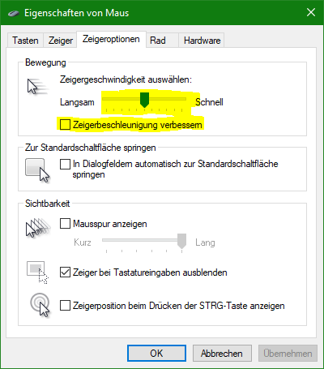
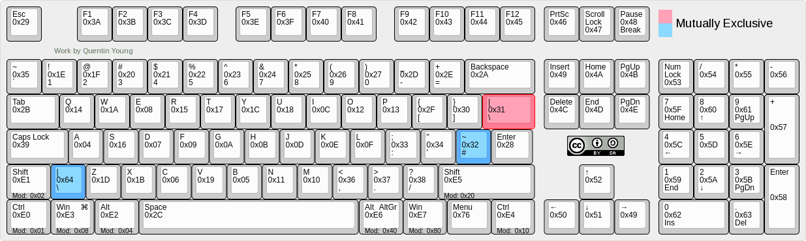

Interface Board
===============
The Interface Board is a way Communicate to a wide range of different devices.
Currently, the following Functionalities are possible:

* Emulate a USB Mouse
* Emulate a USB Keyboard

Mouse
-----
For correct pixel placement it is important to set the following settings:



Keyboard
--------
USB KeyCodes are defined in the [HID Usage Tables Chapter 10](doc/hut1_4.pdf#page=90).
Only keys from 0x00 to 0x77 (Keyboard Select) and the modefeier Keys 0xE0 (Keyboard LeftControl) to 0xE7 (Keyboard Right GUI) are supported.
The modefeier keys (0xE0-0xE7) are remapped to 0x78 to 0x7F.

USB Keyboards use the following key-codes:



For the Methods update and sequence you can use the highest bit (0x80) to specify if the Key should be pressed or not:

```

```

Versions
--------
0.1 Mouse Control